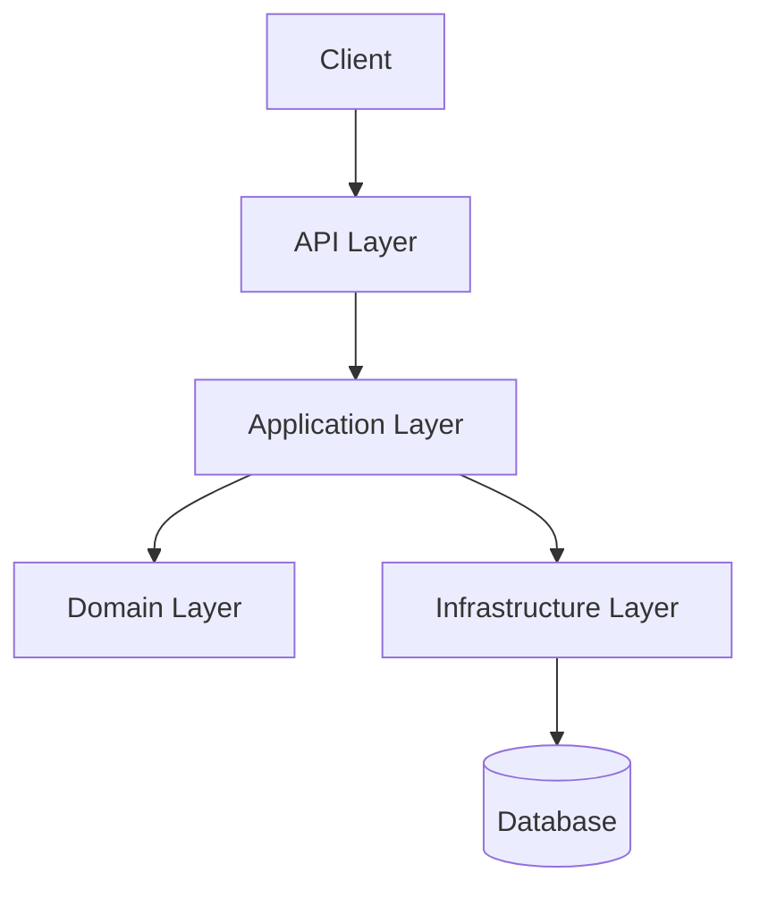
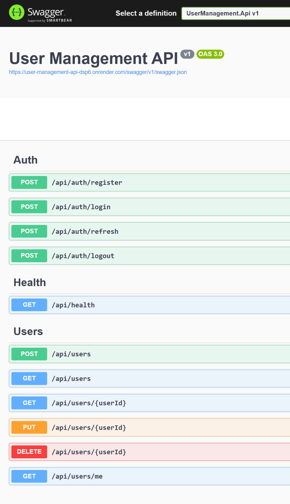
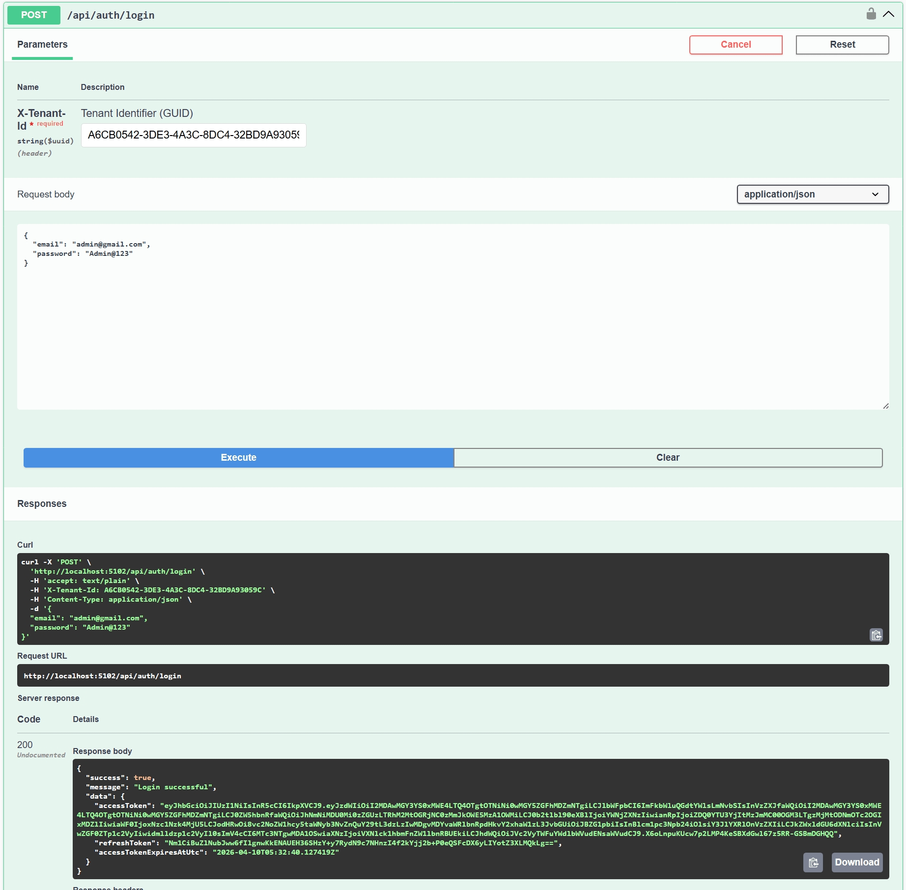
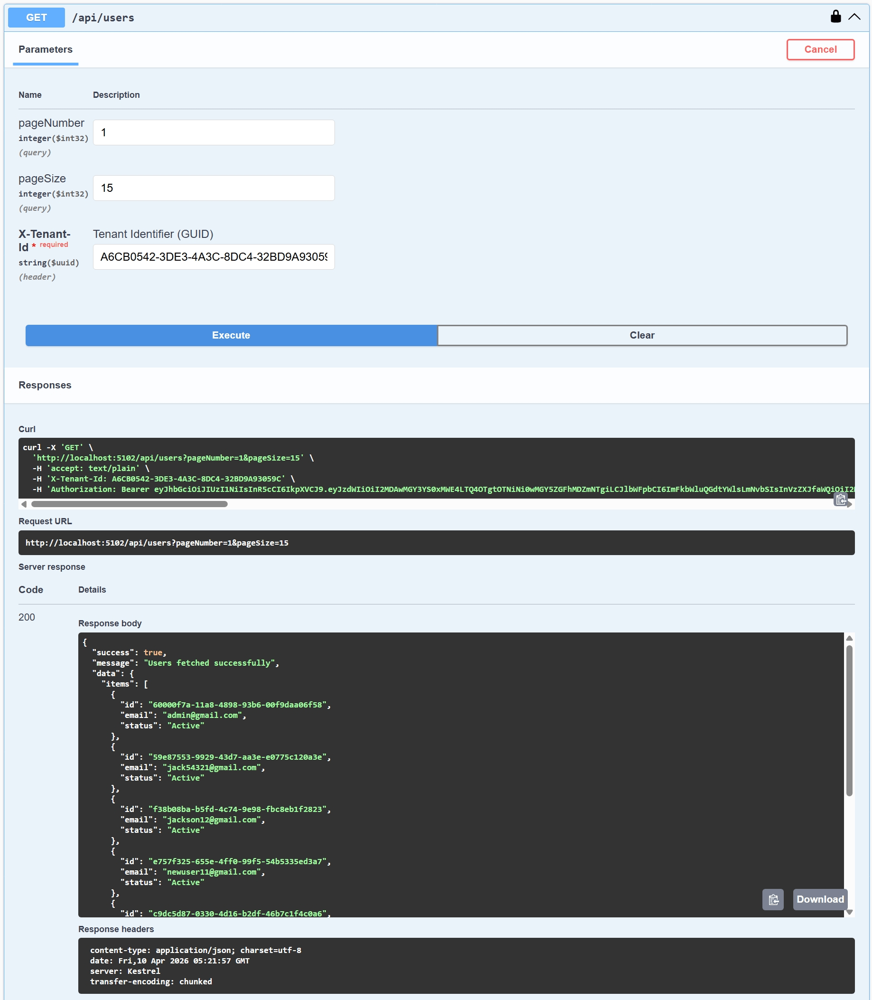
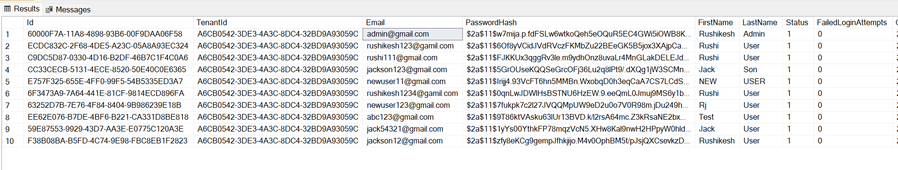

## 🌐 Live API

🔗 Base URL:
https://user-management-api-dsp6.onrender.com

📘 Swagger UI:
https://user-management-api-dsp6.onrender.com/swagger

# :rocket: User Management & Authentication System

A **production-ready ASP.NET Core Web API** for managing users, roles, authentication, and permissions using **Clean Architecture** and **JWT-based security**.

---

## :pushpin: Project Overview

This project is a **multi-tenant User Management System** designed with industry best practices:

* :lock: Secure authentication using JWT
* :shield: Role-based and permission-based authorization
* :building_construction: Clean Architecture (Domain, Application, Infrastructure, API)
* :floppy_disk: Entity Framework Core with SQL Server
* :recycle: Soft Delete with Audit Logging
* :zap: Rate Limiting + Global Exception Handling
* :page_facing_up: Swagger API documentation

---

## :sparkles: Features

### :closed_lock_with_key: Authentication & Security

* JWT Access Token & Refresh Token
* Secure password hashing
* Token validation with custom claims

### :busts_in_silhouette: User Management

* Create, update, delete users
* Multi-tenant support
* Pagination support

### :balance_scale: Authorization

* Role-based access (Admin, User)
* Permission-based policies
* Custom authorization handlers

### :wastebasket: Soft Delete & Audit

* Users are not deleted permanently
* `IsDeleted`, `DeletedAt`, `DeletedBy`
* Global query filters (auto exclude deleted data)

### :gear: System Features

* Rate limiting (API protection)
* Global exception middleware
* Logging with Serilog
* Health check endpoint

---
## 🏗️ Architecture

This project follows **Clean Architecture** with clear separation of concerns:

```bash
User Management System
│
├── 🟦 UserManagement.Api
│   └── Controllers, Middleware, Swagger
│
├── 🟩 UserManagement.Application
│   └── Business Logic (CQRS, MediatR, Validators)
│
├── 🟨 UserManagement.Domain
│   └── Entities, Enums, Interfaces
│
└── 🟥 UserManagement.Infrastructure
    └── EF Core, Repositories, Security, Persistence
```
---

### 🔁 Request Flow

Client → API → Application → Domain → Infrastructure → Database

---

### 📊 Architecture Diagram


---

## 💻 Tech Stack

* **Backend:** ASP.NET Core Web API (.NET 8)
* **Database:** SQL Server
* **ORM:** Entity Framework Core
* **Authentication:** JWT
* **Architecture:** Clean Architecture + CQRS

### Libraries:

* MediatR
* FluentValidation
* Serilog
* ASP.NET Rate Limiting

---

## 🚀 How to Run

### 1. Clone Repository

```bash
git clone https://github.com/rushikesh-jagdale/user-management-api.git
```

### 2. Update Database Connection

```json
{
  "ConnectionStrings": {
    "DefaultConnection": "your-sql-server-connection"
  }
}
```

### 3. Run Migration

```bash
dotnet ef database update
```

### 4. Run Project

```bash
dotnet run
```

### 5. Open Swagger

```
http://localhost:xxxx/swagger
```

---

## :key: Default Admin Credentials

* Email: [admin@gmail.com](mailto:admin@gmail.com)
* Password: Admin@123

---

## 🔗 API Endpoints

### 🔐 Auth

* `POST /api/auth/register`
* `POST /api/auth/login`
* `POST /api/auth/refresh`
* `POST /api/auth/logout`

### 👤 Users

* `GET /api/users`
* `GET /api/users/{id}`
* `POST /api/users`
* `PUT /api/users/{id}`
* `DELETE /api/users/{id}` *(Soft Delete)*

---

## 📸 Screenshots

### 🔹 API Preview

<table>
  <tr>
    <td align="center"><b>Swagger UI</b></td>
    <td align="center"><b>Login API</b></td>
  </tr>
  <tr>
    <td></td>
    <td></td>
  </tr>
  <tr>
    <td align="center"><b>Users API</b></td>
    <td align="center"><b>Database</b></td>
  </tr>
  <tr>
    <td></td>
    <td></td>
  </tr>
</table>

---

## ⭐ Key Highlights 

✔️ Implemented Clean Architecture + CQRS pattern  
✔️ Designed multi-tenant system with tenant isolation  
✔️ Built JWT Authentication with Refresh Token mechanism  
✔️ Implemented role-based & permission-based authorization  
✔️ Created custom authorization policies & handlers  
✔️ Added soft delete with global query filters (EF Core)  
✔️ Integrated rate limiting for API protection  
✔️ Implemented global exception handling middleware  
✔️ Added structured logging using Serilog  
✔️ Built production-ready scalable backend structure

---

## 📈 Future Improvements

* Add Audit Log Table (history tracking)
* Add Restore (Undo delete)
* Docker support
* CI/CD pipeline
* Deployment on Azure / AWS

---

## 👨‍💻 Author

**Rushikesh Jagdale**

---

## 🌟 If you like this project

Give it a ⭐ on GitHub!
